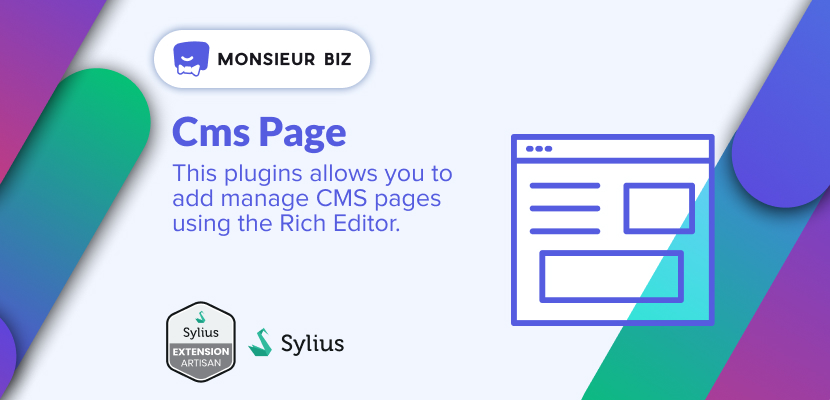

[](https://monsieurbiz.com/agence-web-experte-sylius)

<h1 align="center">Sylius CMS Pages</h1>

[](https://github.com/monsieurbiz/SyliusCmsPagePlugin/blob/master/LICENSE.txt)
[](https://github.com/monsieurbiz/SyliusCmsPagePlugin/actions?query=workflow%3ATests)
[](https://github.com/monsieurbiz/SyliusCmsPagePlugin/actions?query=workflow%3ASecurity)
[](https://github.com/monsieurbiz/SyliusCmsPagePlugin/actions?query=workflow%3ASecurity)

This plugins allows you to add manage CMS pages using the Rich Editor.

If you want to know more about our editor, see the [Rich Editor Repository](https://github.com/monsieurbiz/SyliusRichEditorPlugin)


## Compatibility

| Sylius Version | PHP Version |
|---|---|
| 1.11 | 8.0 - 8.1 |
| 1.12 | 8.1 - 8.2 |
| 1.13 | 8.1 - 8.2 |

## Installation

If you want to use our recipes, you can configure your composer.json by running:

```bash
composer config --no-plugins --json extra.symfony.endpoint '["https://api.github.com/repos/monsieurbiz/symfony-recipes/contents/index.json?ref=flex/master","flex://defaults"]'
```

```bash
composer require monsieurbiz/sylius-cms-page-plugin
```

Change your `config/bundles.php` file to add the line for the plugin : 

```php
<?php

return [
    //..
    MonsieurBiz\SyliusCmsPagePlugin\MonsieurBizSyliusCmsPagePlugin::class => ['all' => true],
];
```

Then create the config file in `config/packages/monsieurbiz_sylius_cms_page_plugin.yaml` :

```yaml
imports:
    - { resource: "@MonsieurBizSyliusCmsPagePlugin/Resources/config/config.yaml" }
```

Finally import the routes in `config/routes/monsieurbiz_sylius_cms_page_plugin.yaml` : 

```yaml
monsieurbiz_cms_page_admin:
    resource: "@MonsieurBizSyliusCmsPagePlugin/Resources/config/routing/admin.yaml"
    prefix: /%sylius_admin.path_name%

monsieurbiz_cms_page_shop:
    resource: "@MonsieurBizSyliusCmsPagePlugin/Resources/config/routing/shop.yaml"
    prefix: /{_locale}
```

### Migrations

First, please run legacy-versioned migrations by using command :

```bash
bin/console doctrine:migrations:migrate
```

After migration, please create a new diff migration :

```php
bin/console doctrine:migrations:diff
```

Then run it (if any) : 

```php
bin/console doctrine:migrations:migrate
```

## Example of complete CMS Page

### Admin form with preview


### Front display


## Create custom elements

You can customize and create custom elements in your page.  
In order to do that, you can check the [Rich Editor custom element creation](https://github.com/monsieurbiz/SyliusRichEditorPlugin#create-your-own-elements)

## SEO Friendly

You can define for every page the meta title, meta description and meta 
keywords.

## Troubleshooting

### Locale not found

We've added a new LocaleContext (`LastChanceLocaleContext`) because the locale isn't set in the request when the
condition on the route is applied.  
Therefore, if you still have an issue with multiple locales in your project, you may need to add another LocaleContext
in order to find out your locale. The system will take care of the rest.

## Contributing

You can open an issue or a Pull Request if you want! 😘  
Thank you!
