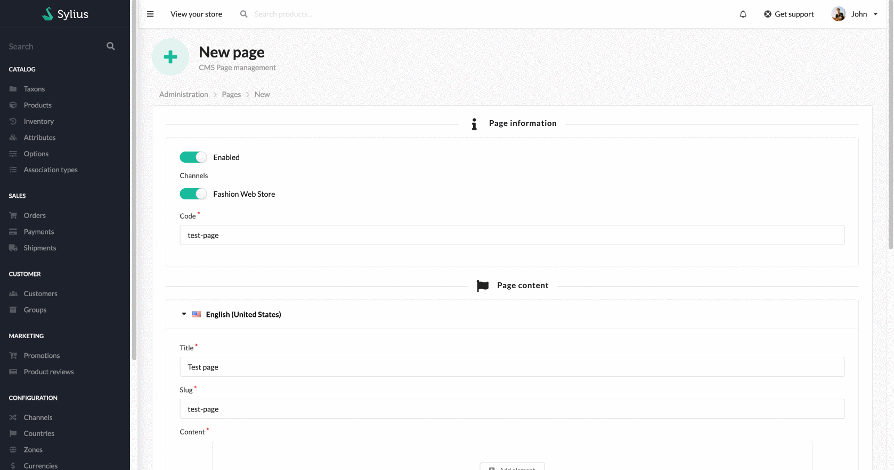
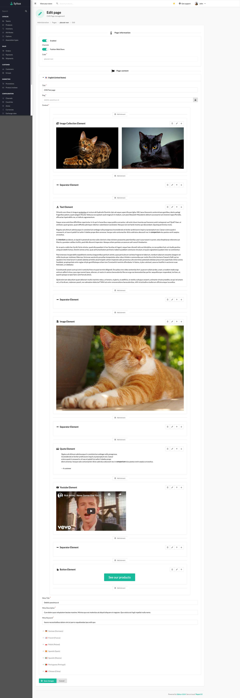
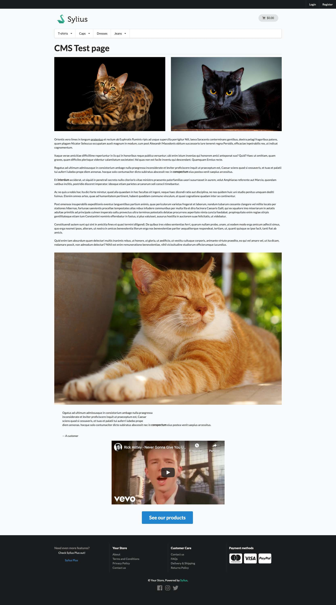

<p align="center">
    <a href="https://monsieurbiz.com" target="_blank">
        
    </a>
    &nbsp;&nbsp;&nbsp;&nbsp;
    <a href="https://monsieurbiz.com/agence-web-experte-sylius" target="_blank">
        
    </a>
    <br/>
    
</p>

<h1 align="center">CMS Pages</h1>

[](https://github.com/monsieurbiz/SyliusCmsPagePlugin/blob/master/LICENSE)
[](https://github.com/monsieurbiz/SyliusCmsPagePlugin/actions?query=workflow%3A%22PHP+Composer%22)
[](https://scrutinizer-ci.com/g/monsieurbiz/SyliusCmsPagePlugin/?branch=master)

This plugins allows you to add manage CMS pages using the Rich Editor.

If you want to know more about our editor, see the [Rich Editor Repository](https://github.com/monsieurbiz/SyliusRichEditorPlugin)



## Installation

```bash
composer require monsieurbiz/sylius-cms-page-plugin
```

Change your `config/bundles.php` file to add the line for the plugin : 

```php
<?php

return [
    //..
    MonsieurBiz\SyliusCmsPagePlugin\MonsieurBizSyliusCmsPagePlugin::class => ['all' => true],
];
```

Then create the config file in `config/packages/monsieurbiz_sylius_cms_page_plugin.yaml` :

```yaml
imports:
    - { resource: "@MonsieurBizSyliusCmsPagePlugin/Resources/config/config.yaml" }
```

Finally import the routes in `config/routes/monsieurbiz_sylius_cms_page_plugin.yaml` : 

```yaml
monsieurbiz_cms_page_admin:
    resource: "@MonsieurBizSyliusCmsPagePlugin/Resources/config/routing/admin.yaml"
    prefix: /%sylius_admin.path_name%

monsieurbiz_cms_page_shop:
    resource: "@MonsieurBizSyliusCmsPagePlugin/Resources/config/routing/shop.yaml"
    prefix: /{_locale}
```

### Migrations

Make a doctrine migration diff : 

```php
bin/console doctrine:migrations:diff
```

Then run it : 

```php
bin/console doctrine:migrations:migrate
```

## Example of complete CMS Page

### Admin form with preview



### Front display



## Create custom elements

You can customize and create custom elements in your page.  
In order to do that, you can check the [Rich Editor custom element creation](https://github.com/monsieurbiz/SyliusRichEditorPlugin#create-your-own-elements)

## SEO Friendly

You can define for every page the meta title, meta description and meta 
keywords.

## Contributing

You can open an issue or a Pull Request if you want! 😘  
Thank you!
